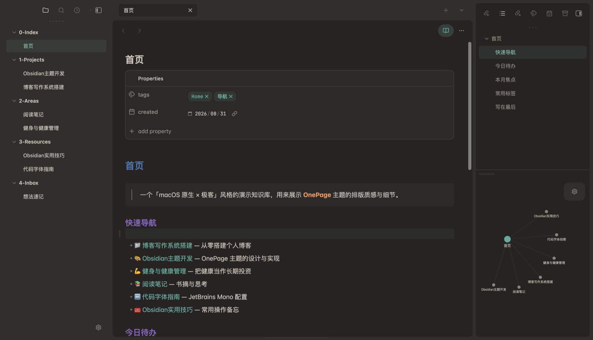
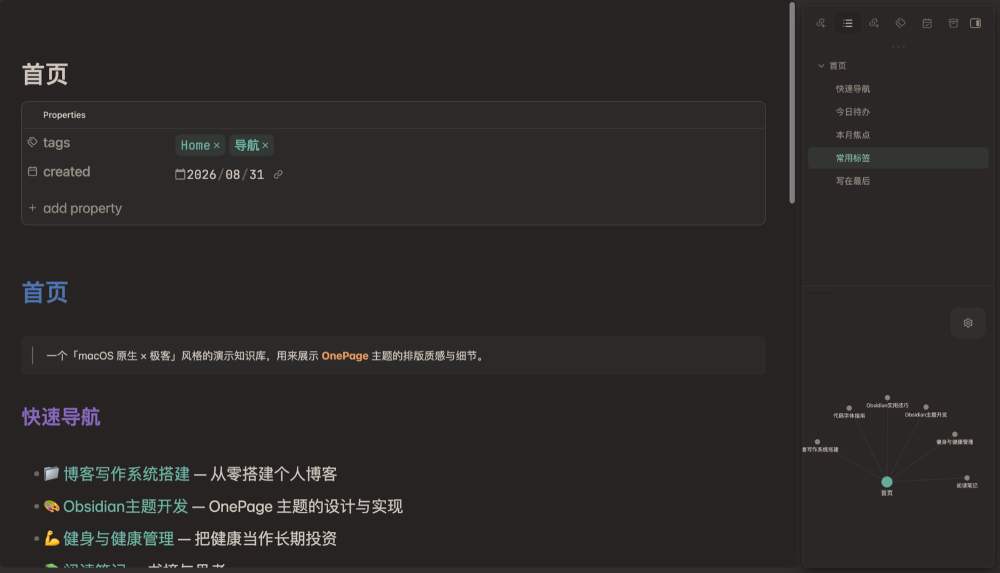

# OnePage

> 🌐 中文 · [English](README_EN.md)

> macOS 原生质感 × 极客编辑器细节 · 暖色护眼双配色 · 开箱即用

OnePage 是一款基于 [Cupertino](https://github.com/aaaaalexis/Obsidian-Cupertino) 深度定制的 Obsidian 主题：
原生 mac 风界面，配上 VSCode 式的编辑器极客细节，暖色纸张配色护眼不刺眼。

- 🌞 **浅色 · 暖白纸张**：米白暖底 + 深青绿强调，阅读像摊开一本暖调的纸书
- 🌙 **暗色 · 暖棕·冷锚**：暖棕底色 + 冷青绿强调，冷暖对比，深夜护眼不偏冷

**无需 Style Settings 即可完整使用**，两套配色已固化进主题，装完即用。可选装 Style Settings 获得 **Cupertino 同款深度自定义**（强调色 / 布局 / 编辑器 / 无障碍等，见下方说明）

---

## 📣 关注公众号「一页清」

> 🎁 使用反馈 · 问题求助 · 合作交流
>
> 微信搜一搜 **「一页清」**，私信即可，我都会一一回复 ❤️

---

## 特性

- **编辑器极客细节**：当前行轻高亮、行号强调色、2px 强调色光标、Markdown 符号弱化
- **代码精修**：JetBrains Mono 连字、行内代码药丸化、代码块圆角边框
- **阅读质感**：标题负字距微调、链接细下划线、精致引用块、彩色排版（标题/加粗/斜体分层配色）
- **UI 原生感**：macOS 胶囊标签、极细滚动条、状态栏轻量、Notion 风格文件树与属性面板
- ⚠️ **窗口透明（不建议开启）**：开启 Obsidian「窗口透明」虽可呈现毛玻璃质感，但 macOS 上 Electron 的合成 bug 会导致文字重影/残影，建议保持关闭（详见下方说明）
- **演示模式**：放大字号、隐藏侧栏/标签栏/状态栏，一键投屏阅读（见下方说明）
- **深度自定义**：可选装 Style Settings，继承 Cupertino 全部开关 + OnePage 专属配色项（见下方说明）
- **聚焦编辑**：编辑时侧栏与其它 Tab 自动弱化，悬停恢复

## 截图

> macOS 原生质感 × 极客编辑器细节，两套配色开箱即用。

| 暖白纸张 · 浅色 | 暖棕·冷锚 · 深色 |
| :---: | :---: |
|  |  |

**演示模式**（一键投屏：放大字号，隐藏侧栏 / 标签栏 / 状态栏）

| 演示模式 · 浅色 | 演示模式 · 深色 |
| :---: | :---: |
|  |  |

> 官方目录缩略图：[浅色 512×288](screenshot.png) · [深色 512×288](screenshot-dark.png)

## 安装

### 方式一：官方主题目录（推荐优先）

OnePage 已上架 Obsidian **官方主题目录**，最省心、自动跟随更新：

1. 设置 → 外观 → 主题 → **浏览**
2. 搜索 **OnePage** → 点击安装
3. 在主题列表中选择启用

### 方式二：从主题仓库下载

想第一时间用上最新版本，或手动管理：

1. 访问仓库：**https://github.com/ivaneye/OnePage**
2. 打开 **Releases** 下载最新版，或直接下载仓库中的 `theme.css` + `manifest.json`
3. 放入你的 vault：`.obsidian/themes/OnePage/`
4. 设置 → 外观 → 主题，选择 **OnePage**

### 方式三：BRAT 插件

1. 安装 [BRAT](https://github.com/TfTHacker/obsidian42-brat) 插件
2. 添加仓库：`ivaneye/OnePage`
3. 安装后在外观里启用

---

## ⚠️ 关于「窗口透明」（不建议开启）

开启 **「窗口透明」** 后，左右边栏可呈现半透明磨砂 + 柔和投影的悬浮卡片，与 macOS 原生质感浑然一体。

但 **macOS 上 Electron 的渲染合成 bug** 会导致开启后出现**文字重影/残影**（滚动文件列表、关闭/切换标签页时尤为明显），且 CSS 层面无法根治（已尝试实底兜底、强制合成层等手段均无效）。

**因此不建议开启「窗口透明」**，请保持关闭：

设置 → 外观 → **关闭「窗口透明」**。

若已开启，关闭后**重启 Obsidian** 即可恢复正常显示。

## ⚠️ 必读：字体依赖

主题默认的代码字体是 **JetBrains Mono Nerd Font**（`JetBrainsMono NFM`）。

- ✅ **已安装**：直接获得完整效果（等宽 + 图标字形 + 连字）
- ❌ **未安装**：会自动回退到系统等宽字体（SF Mono / Menlo / Consolas），主体效果不受影响，仅代码区字体不同

下载：<https://www.nerdfonts.com/font-downloads> → 搜索 **JetBrainsMono** 下载安装即可。
（macOS：双击 ttf 文件 → 安装字体；Windows/Linux 同理）

## Style Settings 深度自定义（可选）

OnePage 完整继承了 **Cupertino** 的 Style Settings 配置，装好 [Style Settings](obsidian://show-plugin?id=obsidian-style-settings) 插件后在「设置 → Style Settings → OnePage」即可调整：

> 🌐 **中英双语**：设置面板跟随 Obsidian 界面语言自动切换（中文/English）。切换语言后重新打开 Style Settings 面板即可生效。

- **配色**：强调色（浅/暗各一，改一处全局联动）、关闭彩色排版、正文行高、彩色侧边栏
- **布局**：悬停功能区 / 悬停侧边栏 / 聚焦视图、**始终显示 Vault 选择**、**始终显示状态栏**、关闭紧凑面板操作 / 紧凑侧栏标签、关闭媒体缩放
- **演示**：演示模式（投屏，可绑快捷键）、演示模式字号
- **编辑器**：关闭当前行高亮 / 横幅 / 块宽 / 字体特性 / 全宽元素 / 快速模式切换
- **无障碍**：关闭自适应模式、减少对比度变化、减少动效、标准字号、界面字号与图标尺寸微调、链接下划线

> 所有开关默认值与 OnePage 设计固化值一致，不装 Style Settings 也能开箱即用。

## 演示模式（可选）

一键切换纯阅读投屏画布：放大字号（24px）、隐藏左侧栏/状态栏/标题栏，保留右侧目录。

**启用方式**（任选其一）：

1. **推荐**：安装 [Style Settings](obsidian://show-plugin?id=obsidian-style-settings) 插件 → 命令面板出现「Toggle 演示模式（投屏）」→ 在 设置→快捷键 中绑定任意快捷键（如 `Cmd+Shift+P`）
2. 在开发者模式下手动给 `body` 添加 `demo-mode` 类

> 说明：演示模式开关由 Style Settings 生成命令，属于**可选依赖**。不装 Style Settings 时，两套配色与全部样式照常生效，仅演示模式无快捷键开关。

## 反馈与支持

使用中遇到任何问题、或有改进建议，欢迎**关注公众号「一页清」私信反馈**（微信搜一搜即可，记得点关注，不迷路）。

如果 OnePage 对你有帮助，也欢迎**分享给身边用 Obsidian 的朋友**，你的推荐是我持续维护的最大动力 🙏

## 开源规范

- 本项目基于 [Cupertino](https://github.com/aaaaalexis/Obsidian-Cupertino)（MIT License, Copyright (c) 2025 aaaaalexis）二次开发
- 遵循 MIT 协议，详见 [LICENSE](./LICENSE)
- 上游更新时，OnePage 将同步合并 Cupertino 的更新

## 更新日志

### 1.1.0

- 引入完整 **Style Settings** 支持（继承 Cupertino 全部开关 + OnePage 专属项）
  - **配色**：强调色（浅/暗）、关闭彩色排版、正文行高、彩色侧边栏、动态配色
  - **布局**：悬停功能区/侧栏、聚焦视图、始终显示 Vault 选择、始终显示状态栏、紧凑面板等
  - **演示**：演示模式（可绑快捷键）、演示字号
  - **编辑器 / 无障碍**：当前行高亮、横幅、块宽、字体特性、自适应模式、动效、字号微调等
- 设置面板**中英双语**（跟随 Obsidian 界面语言自动切换）
- 移除「关闭紧凑状态栏」开关
- 修复「始终显示 Vault 选择」开启后透明穿字问题

### 1.0.0

- 首个发布版本：基于 Cupertino 3.2.12
- 固化两套配色（暖白纸张 / 暖棕·冷锚）
- 整合极客编辑器细节、macOS 胶囊标签、Notion 风格文件树等定制
