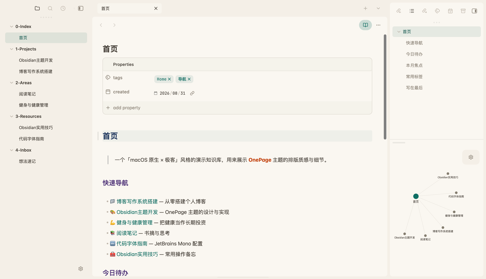
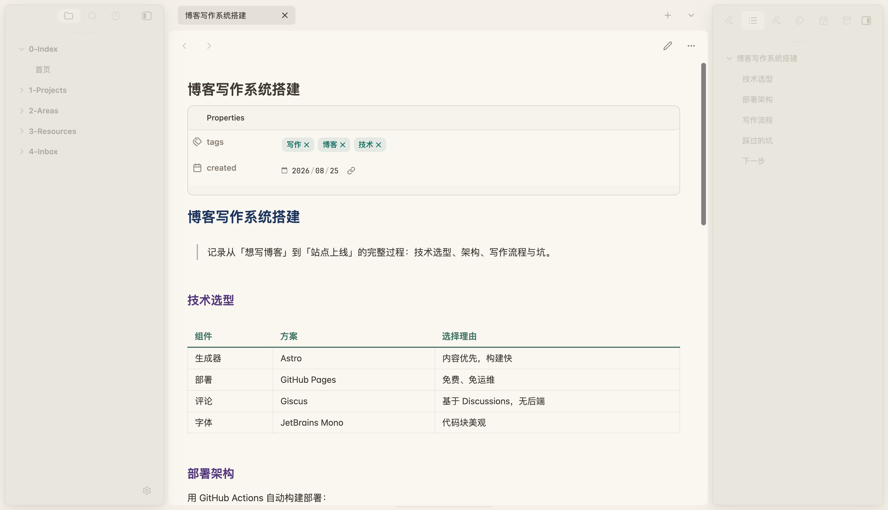
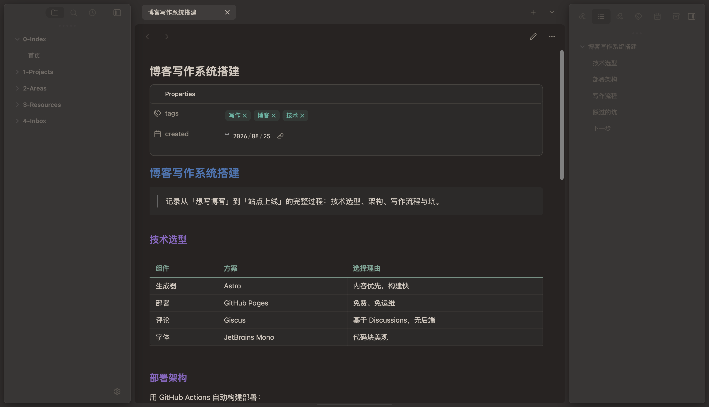
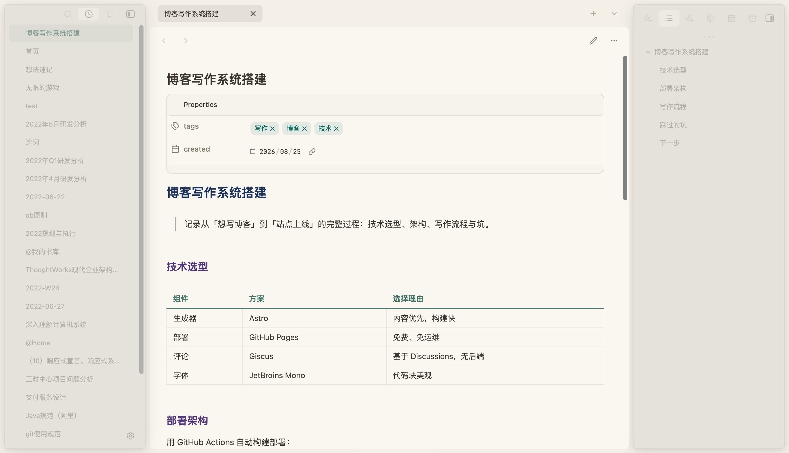
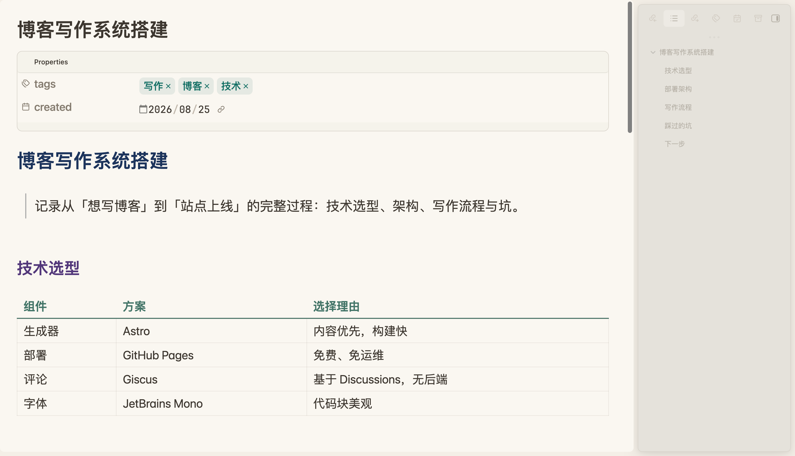

# OnePage

> macOS 原生质感 × 极客编辑器细节 · 暖色护眼双配色 · 开箱即用

OnePage 是一款基于 [Cupertino](https://github.com/aaaaalexis/Obsidian-Cupertino) 深度定制的 Obsidian 主题：
原生 mac 风界面，配上 VSCode 式的编辑器极客细节，暖色纸张配色护眼不刺眼。

- 🌞 **浅色 · 暖白纸张**：米白暖底 + 深青绿强调，阅读像摊开一本暖调的纸书
- 🌙 **暗色 · 暖棕·冷锚**：暖棕底色 + 冷青绿强调，冷暖对比，深夜护眼不偏冷

**无需 Style Settings 即可完整使用**，两套配色已固化进主题，装完即用。（仅「演示模式」开关需可选安装 Style Settings，见下方说明）

---

## 特性

- **编辑器极客细节**：当前行轻高亮、行号强调色、2px 强调色光标、Markdown 符号弱化
- **代码精修**：JetBrains Mono 连字、行内代码药丸化、代码块圆角边框
- **阅读质感**：标题负字距微调、链接细下划线、精致引用块、彩色排版（标题/加粗/斜体分层配色）
- **UI 原生感**：macOS 胶囊标签、极细滚动条、状态栏轻量、Notion 风格文件树与属性面板
- **毛玻璃**：开启 Obsidian「窗口透明」后，边栏呈现半透明浮层 + 柔和投影
- **演示模式**：放大字号、隐藏侧栏/标签栏/状态栏，一键投屏阅读（见下方说明）
- **聚焦编辑**：编辑时侧栏与其它 Tab 自动弱化，悬停恢复

## 截图

| 阅读模式 · 浅色 | 阅读模式 · 深色 |
| --- | --- |
|  |  |

| 最近文件 | 演示模式 |
| --- | --- |
|  |  |

> 官方目录缩略图：[浅色 512×288](screenshot.png) · [深色 512×288](screenshot-dark.png)

## 安装

### 方式一：GitHub 下载（推荐，最快）

1. 下载本仓库最新 Release 中的 `OnePage` 文件夹（或 `theme.css` + `manifest.json`）
2. 放入你的 vault：`.obsidian/themes/OnePage/`
3. 设置 → 外观 → 主题，选择 **OnePage**

### 方式二：BRAT 插件

1. 安装 [BRAT](https://github.com/TfTHacker/obsidian42-brat) 插件
2. 添加仓库：`ivaneye/OnePage`
3. 安装后在外观里启用

### 方式三：官方主题目录

已提交（待审核通过后可直接在「外观 → 浏览」中搜索 **OnePage**）。

## ⚠️ 必读：字体依赖

主题默认的代码字体是 **JetBrains Mono Nerd Font**（`JetBrainsMono NFM`）。

- ✅ **已安装**：直接获得完整效果（等宽 + 图标字形 + 连字）
- ❌ **未安装**：会自动回退到系统等宽字体（SF Mono / Menlo / Consolas），主体效果不受影响，仅代码区字体不同

下载：<https://www.nerdfonts.com/font-downloads> → 搜索 **JetBrainsMono** 下载安装即可。
（macOS：双击 ttf 文件 → 安装字体；Windows/Linux 同理）

## 毛玻璃（可选）

若想要边栏毛玻璃效果：
设置 → 外观 → 打开 **「窗口透明」** → 重启 Obsidian。
不开也不影响任何功能，只是边栏为实色背景。

## 演示模式（可选）

一键切换纯阅读投屏画布：放大字号（24px）、隐藏左侧栏/状态栏/标题栏，保留右侧目录。

**启用方式**（任选其一）：

1. **推荐**：安装 [Style Settings](obsidian://show-plugin?id=obsidian-style-settings) 插件 → 命令面板出现「Toggle 演示模式（投屏）」→ 在 设置→快捷键 中绑定任意快捷键（如 `Cmd+Shift+P`）
2. 在开发者模式下手动给 `body` 添加 `demo-mode` 类

> 说明：演示模式开关由 Style Settings 生成命令，属于**可选依赖**。不装 Style Settings 时，两套配色与全部样式照常生效，仅演示模式无快捷键开关。

## 开源规范

- 本项目基于 [Cupertino](https://github.com/aaaaalexis/Obsidian-Cupertino)（MIT License, Copyright (c) 2025 aaaaalexis）二次开发
- 遵循 MIT 协议，详见 [LICENSE](./LICENSE)
- 上游更新时，OnePage 将同步合并 Cupertino 的更新

## 更新日志

### 1.0.0

- 首个发布版本：基于 Cupertino 3.2.12
- 固化两套配色（暖白纸张 / 暖棕·冷锚），移除 Style Settings 依赖
- 整合极客编辑器细节、macOS 胶囊标签、Notion 风格文件树等定制
